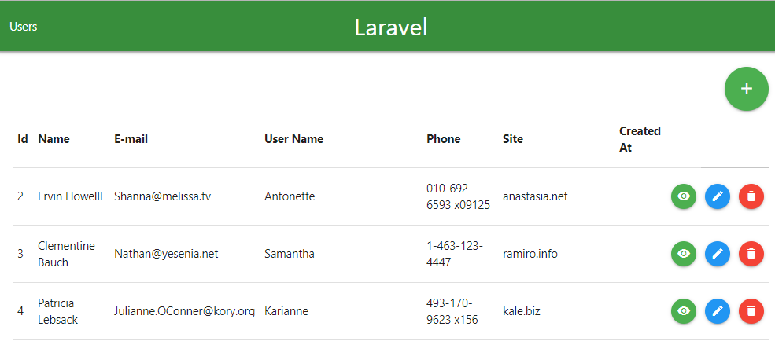

# Teste Mobly `teste-programador-php`:

Referência:  
`https://github.com/mobly/teste-programador-php/tree/master/teste-api` 

TL;DR:   


* "Importe usuários e posts de uma API e guarde em um banco de dados MySQL"   

Feito no ato do migration -> `Install in Local`

* "Possuir uma tela para listar os usuários, com ações de adicionar, editar e excluir"  

O CRUD pode se acessado da URL: `http://localhost:8000/users`
  


Onde possui os botões: `Adicionar`  
  

Exibir `detalhes do Usuario` e `Posts` do mesmo, `Editar` e `Excluir`  
  


* "Tenha APIs que retornem os dados do banco de dados no formato JSON"  

No caso preferi separar a url:  

```
(Listar todos os Usuarios em Json)
http://localhost:8000/api/users

(Listar todos os Posts do Usuario em Json)
http://localhost:8000/api/users/{id}/posts
```
Como pode ser visto no arquivo: `routes/api.php` 


## Install in Local

```bash
git clone URL `https://github.com/gabrieldarezzo/mobly-private.git` mobly
cd mobly
cp .env.example .env
```
Create a database:
```sql
CREATE DATABASE mobly COLLATE 'utf8_general_ci';
```
-> Set this base in your `.env`, like this:
```
APP_NAME=Laravel
APP_ENV=local
APP_KEY=
APP_DEBUG=true
APP_URL=http://localhost:8000

LOG_CHANNEL=stack

DB_CONNECTION=mysql
DB_HOST=127.0.0.1
DB_PORT=3306
DB_DATABASE=mobly
DB_USERNAME=root
DB_PASSWORD=
```


```bash
composer install
php artisan key:generate
php artisan config:clear
php artisan config:cache
php artisan serve
```


Seed tables:
```bash
php artisan migrate --seed
```

### With this command you'll LOSING whatever data is in the tables and recreate then:  
```bash
php artisan migrate:refresh --seed
```

## In Production server (1°/First Deploy)
```bash
git clone URL https://github.com/gabrieldarezzo/mobly-private.git mobly
cd mobly
composer install --no-dev --prefer-dist


### Symbolic lin for deploy:
In Laravel you dont need expose more than /public_html
```shell 
cd ~ && ln -s -f /home/storage/mobly/public /home/storage/public_html/mobly  
```    

## Updates:
Artisan server for develop app
```shell
php artisan serve --host 192.168.11 --port 8000
```
Ps: `192.168.11` === IPv4 ok?!


##  /Migration/Model/Seeder/Factory':
Glue 4Developers 
```shell
php artisan make:migration create_company_table --create=company --table=company
php artisan make:model Post
php artisan make:seeder PostsTableSeeder
php artisan make:controller PostController
```

Ps: Don't forget add in `DatabaseSeeder.php` ;-)
```php
$this->call(TemasTableSeeder::class);
```

In `routes/api.php`, Add your resource, for CRUD if you want use superTrait ^^ 
```php
Route::resource('action', 'ActionController');
``` 

Ps: It's good run this if composer command `git pull` if your anyone has add:
```shell
composer dump-autoload
```

